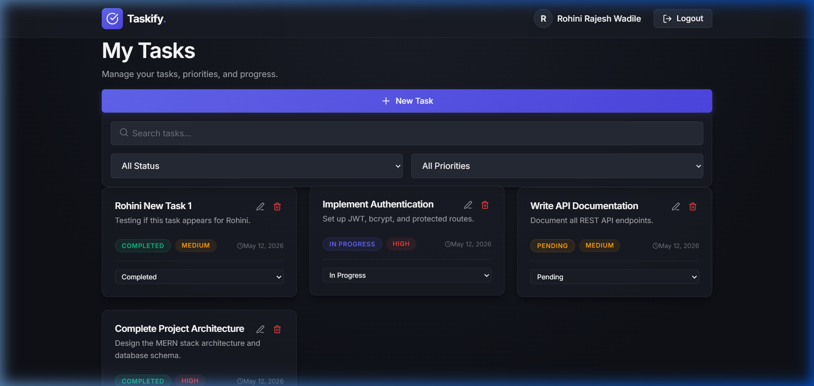
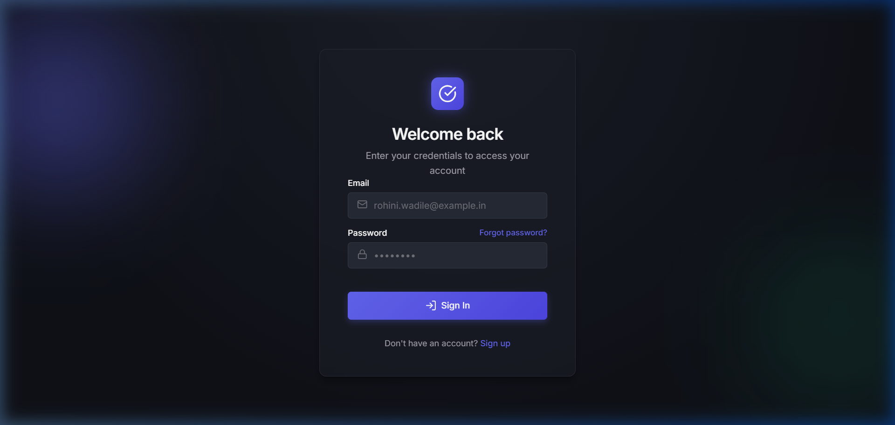
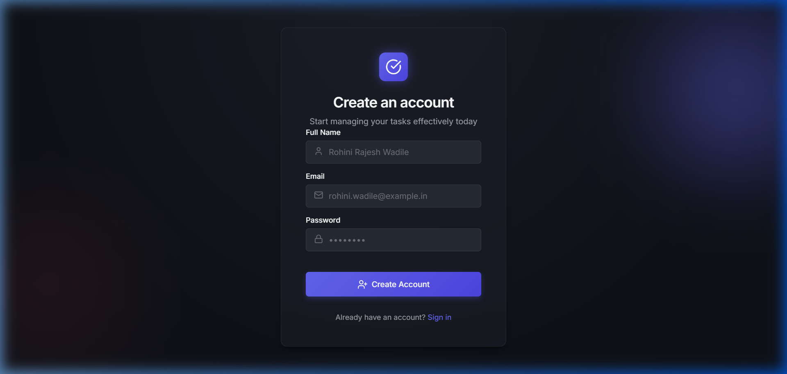

# Taskify - Advanced Task Management Application

A modern, full-stack MERN (MongoDB, Express.js, React.js, Node.js) application designed for professional task management.

## 🚀 Features
- **Secure Authentication**: JWT-based user registration and login.
- **Task Management**: Create, read, update, and delete tasks.
- **Advanced Filtering**: Filter tasks by status and priority, and search by title or description.
- **Pagination & Sorting**: Efficiently navigate through large lists of tasks.
- **Premium UI/UX**: Built with custom, highly responsive, and beautiful CSS using glassmorphism and modern design principles.
- **Protected Routes**: Secure frontend navigation.

## 📸 Screenshots

### Dashboard


### Login Page


### Register Page


## 🛠️ Technology Stack
- **Frontend**: React.js, Vite, Axios, React Router, Lucide React (Icons), React Toastify.
- **Backend**: Node.js, Express.js, Mongoose.
- **Database**: MongoDB.
- **Security**: bcryptjs, jsonwebtoken, helmet, cors.

## ⚙️ Local Setup

### 1. Clone the repository
```bash
git clone <repository_url>
cd ToDoList
```

### 2. Backend Setup
```bash
cd backend
npm install
```
- Create a `.env` file in the `backend` directory (refer to `.env.example`).
- Start the server:
```bash
npm run dev
```

### 3. Frontend Setup
```bash
cd frontend
npm install
```
- Start the development server:
```bash
npm run dev
```

## 📖 API Documentation

### Authentication endpoints:
- `POST /api/auth/register`: Register a new user
- `POST /api/auth/login`: Authenticate user and get token
- `GET /api/auth/me`: Get current logged-in user

### Task endpoints (Requires Bearer Token):
- `POST /api/tasks`: Create a new task
- `GET /api/tasks`: Get all tasks (supports query params: `status`, `priority`, `search`, `page`, `limit`, `sort`)
- `GET /api/tasks/:id`: Get a specific task
- `PUT /api/tasks/:id`: Update a task
- `DELETE /api/tasks/:id`: Delete a task

## 🚀 Deployment Guide

### Backend (Render / Railway)
1. Push your code to GitHub.
2. Connect your repository to Render or Railway.
3. Add the environment variables from your `.env` file.
4. Set the build command to `npm install` and start command to `node server.js` (Ensure you set the working directory to `backend`).

### Frontend (Vercel / Netlify)
1. Connect your repository to Vercel or Netlify.
2. Set the root directory to `frontend`.
3. Vercel/Netlify will automatically detect Vite and configure the build settings (`npm run build`, `dist` folder).
4. Add the `VITE_API_URL` environment variable pointing to your deployed backend URL.

### Database (MongoDB Atlas)
1. Create a cluster on MongoDB Atlas.
2. Allow access from any IP (`0.0.0.0/0`) or your deployment service's IP.
3. Get your connection string and add it to your backend's `MONGODB_URI` environment variable.
